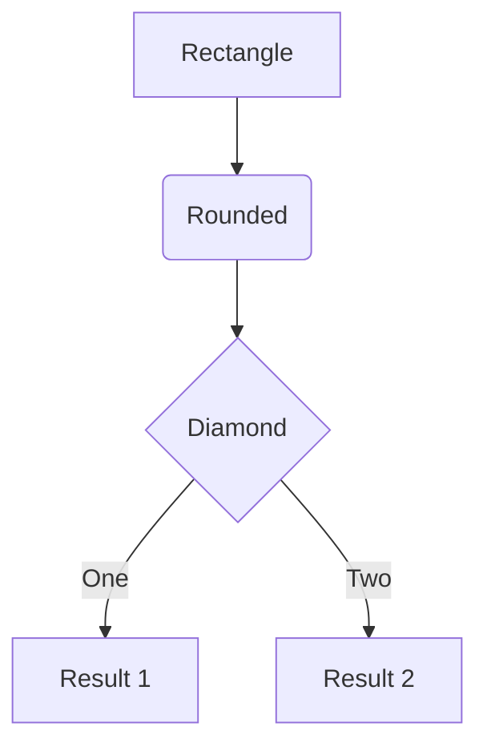
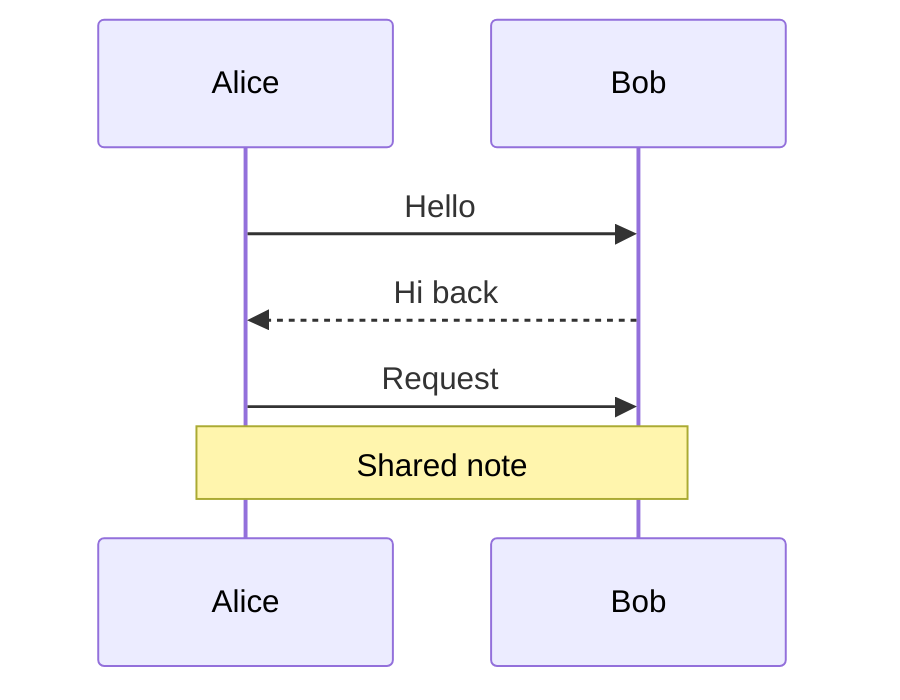
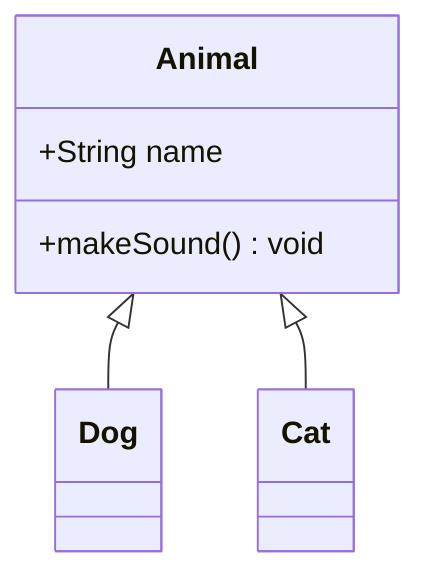
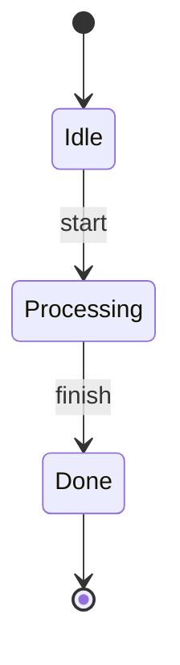
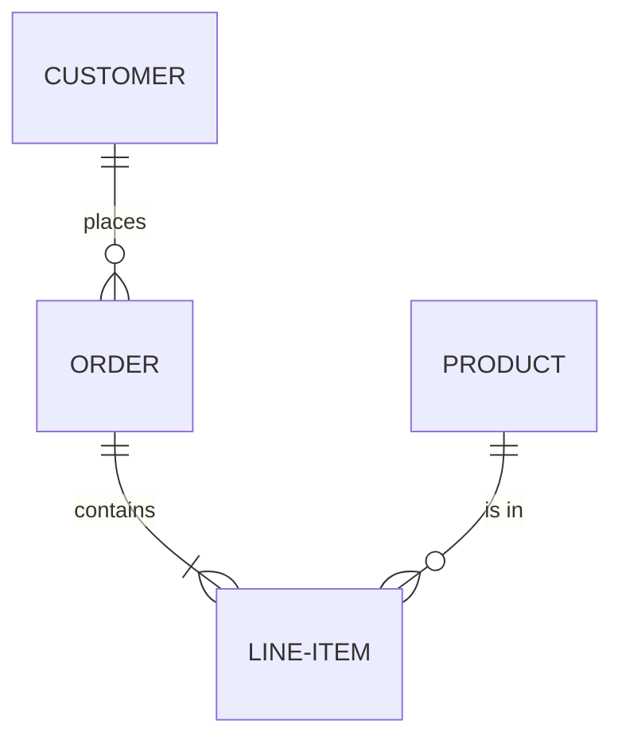
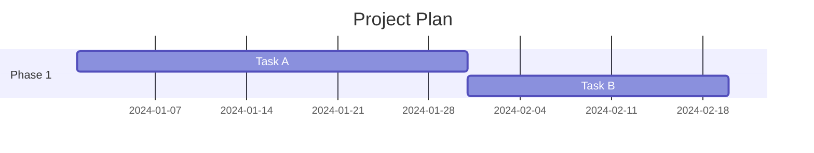
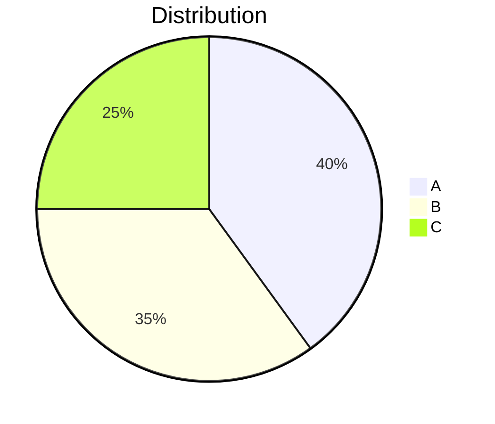
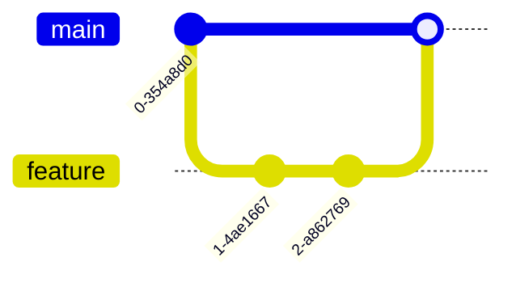
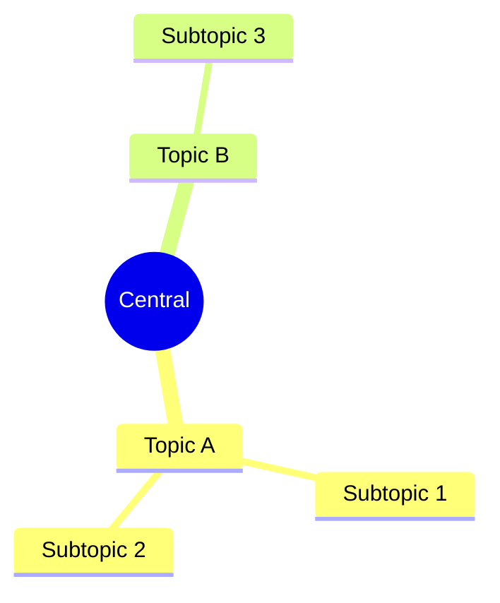
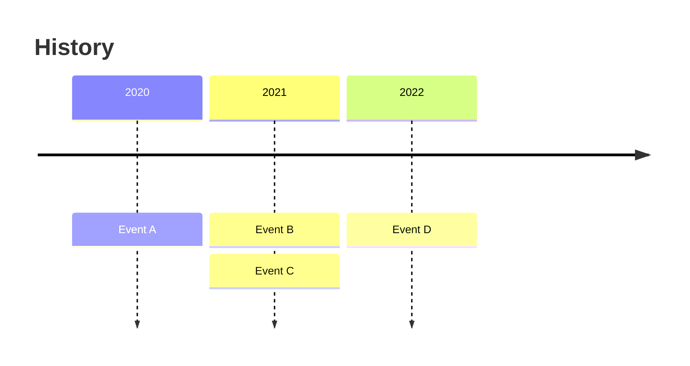

# Mermaid Diagram Renderer

Generate Mermaid diagrams as HTML files and open them in the browser for instant visualization.

## Quick Start

Pipe mermaid code to the render script:

```bash
echo 'flowchart TD
  A[Start] --> B{Decision}
  B -->|Yes| C[OK]
  B -->|No| D[Cancel]' | bun $SKILL_DIR/scripts/render.ts
```

### Options

| Flag             | Description                                           |
| ---------------- | ----------------------------------------------------- |
| `--theme <name>` | Mermaid theme: `default`, `dark`, `forest`, `neutral` |
| `--no-open`      | Write HTML file without opening in browser            |

### Examples

```bash
# Dark theme
echo '...' | bun $SKILL_DIR/scripts/render.ts --theme dark

# Write file only (no browser)
echo '...' | bun $SKILL_DIR/scripts/render.ts --no-open
```

## Critical Syntax Rules

**NEVER use literal newlines inside node labels.** Mermaid's parser is line-based — a node definition must be on a single line. Use `<br/>` for line breaks within labels.

```mermaid
%% ❌ WRONG — causes "Syntax error in text"
SWR1["Fresh
30 min"]

%% ✅ CORRECT
SWR1["Fresh<br/>30 min"]
```

## Mermaid Syntax Quick Reference

### Flowchart



Direction: `TD` (top-down), `LR` (left-right), `BT` (bottom-top), `RL` (right-left)

### Sequence Diagram



### Class Diagram



### State Diagram



### Entity Relationship



### Gantt Chart



### Pie Chart



### Git Graph



### Mindmap



### Timeline


