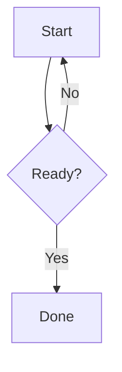
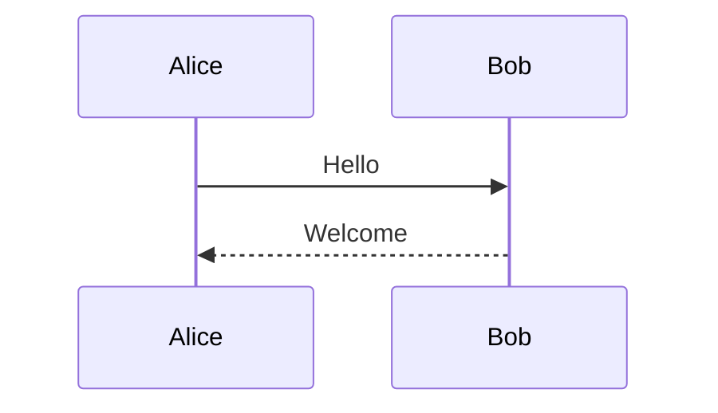
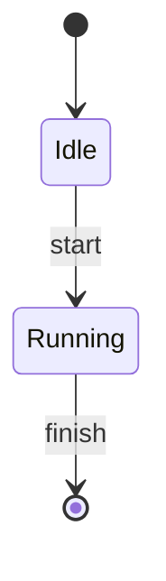
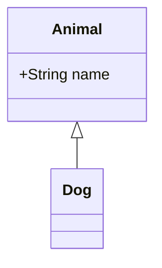
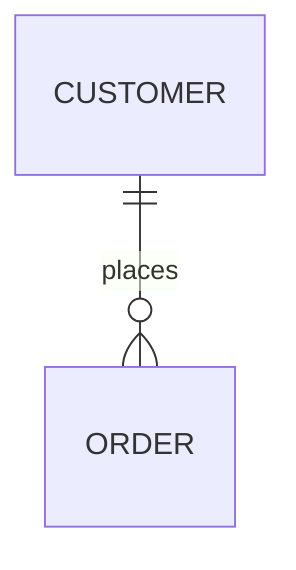
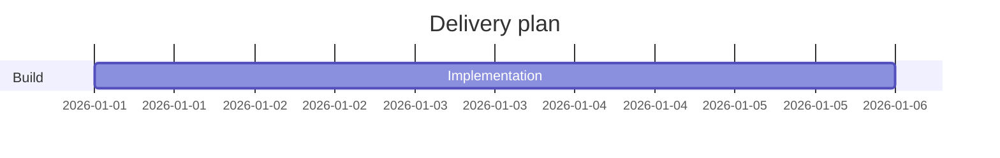
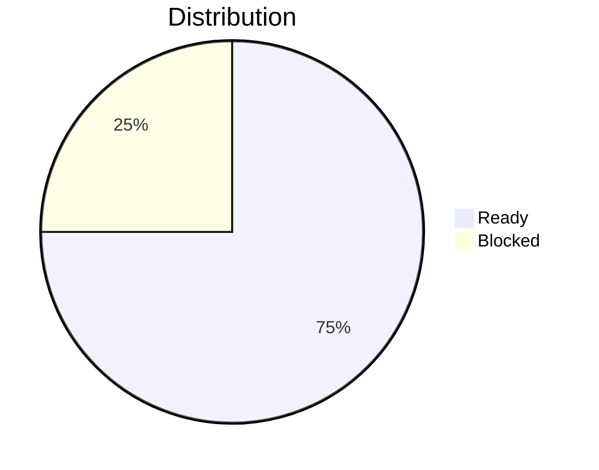
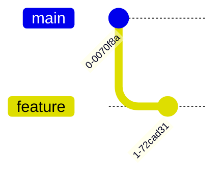
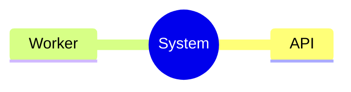
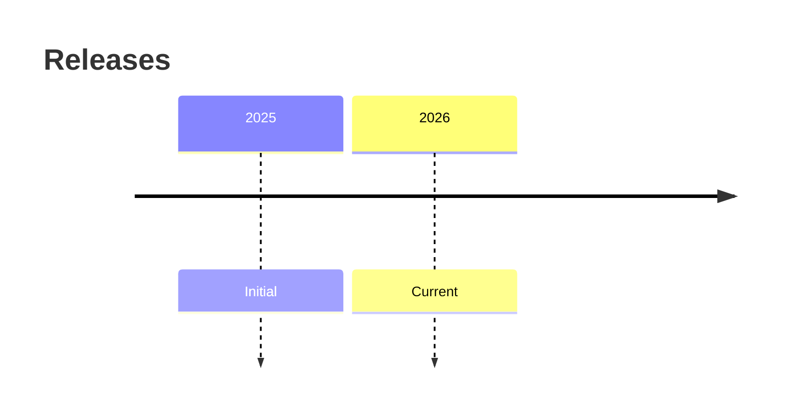

# Valid architecture diagrams

This document contains several supported Mermaid diagram types.

```mermaid
flowchart TD
  Start[Start] --> Decision{Ready?}
  Decision -->|Yes| Done[Done]
  Decision -->|No| Start
```

```mermaid
sequenceDiagram
  participant A as Alice
  participant B as Bob
  A->>B: Hello
  B-->>A: Welcome
```

```mermaid
stateDiagram-v2
  [*] --> Idle
  Idle --> Running : start
  Running --> [*] : finish
```

```mermaid
classDiagram
  Animal <|-- Dog
  class Animal {
    +String name
  }
```

```mermaid
erDiagram
  CUSTOMER ||--o{ ORDER : places
```

```mermaid
gantt
  title Delivery plan
  dateFormat YYYY-MM-DD
  section Build
    Implementation :2026-01-01, 5d
```

```mermaid
pie title Distribution
  "Ready" : 75
  "Blocked" : 25
```

```mermaid
gitGraph
  commit
  branch feature
  checkout feature
  commit
```

```mermaid
mindmap
  root((System))
    API
    Worker
```

```mermaid
timeline
  title Releases
  2025 : Initial
  2026 : Current
```
