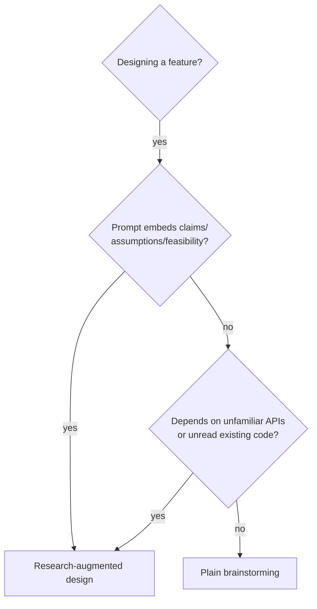
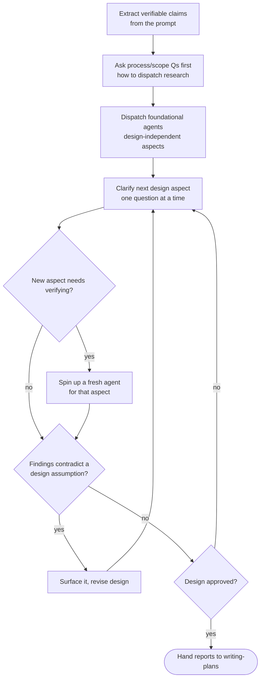

# Research-Augmented Design

## Overview

Most design dialogue fails one of two ways: you ask every clarifying question
serially and only research afterward (so the design is built on unverified
assumptions and gets re-litigated once reality intrudes), or you research
everything upfront blindly (so you waste effort on aspects the user will rule
out in one sentence).

This skill is the third way: **interleave verification with clarification.** As
each aspect of the request gets clarified, dispatch parallel _background_
research agents that verify the assumptions and gather the technical knowledge
embedded in the prompt and your clarifying questions. The design conversation is
then continuously fed by verified, current knowledge — and the same research
reports get reused in the planning and implementation phases instead of thrown
away.

**Core principle:** A prompt is full of claims ("the buttons should morph", "it
should sync across devices", "reuse the existing sheet"). Treat each as a
hypothesis to verify _while_ you design, not a fact to discover is false during
implementation. Surface the binding constraints early, when changing course is
free.

This skill is an overlay on `brainstorming` (it does not replace it) and applies
`dispatching-parallel-agents` to the design phase. Use all three together.

## When to use



**Use when:** the design hinges on whether something is technically possible, on
how an unfamiliar API actually behaves, on framework limits you are guessing at,
or on existing code you have not yet read. Especially when the user signals they
want the knowledge to outlive the chat ("this will be reused in planning").

**Skip when:** the feature is small and fully within known territory — no
external APIs, no unread code, no feasibility risk. Plain `brainstorming` is
enough.

## The loop



## Step 1 — Extract verifiable claims from the prompt

Before asking anything, read the prompt as a list of hypotheses. For each, note
what would have to be true for it to work and how you would confirm it.

| In the prompt                              | Hidden hypothesis                                        | What to verify                                                  |
| ------------------------------------------ | -------------------------------------------------------- | --------------------------------------------------------------- |
| "the buttons should morph between layouts" | The chosen mechanism supports continuous interpolation   | Which API does it; what are its limits on this platform version |
| "reuse the existing sheet"                 | The existing code can be extended without a rewrite      | Read it: how is it structured, what's its state model           |
| "it should sync in real time"              | The sync layer propagates this kind of change            | How the sync engine actually behaves for this data              |
| "open compact, expand to full"             | The container exposes the state you need to drive layout | Does the API expose the signal (e.g. drag progress) you assume  |

The verifiable claims become your research agents. The genuinely-ambiguous
choices become your clarifying questions.

## Step 2 — Ask process/scope questions first

Before launching agents, settle _how_ research should run. These are the user's
calls, and they change everything downstream. Use `AskUserQuestion`:

- **Dispatch mode** — background `Agent`s feeding the live dialogue, a single
  consolidated research `Workflow`, or hold research until the design is locked.
- **Workflow scope** — which phases (research, implementation, both) get encoded
  as autonomous `Workflow` runs vs. stay interactive.
- **Persistence / worktree** — where research reports and the spec should live.

Note the key constraint up front: a `Workflow` runs autonomously and cannot pause
to ask the user mid-run, so interactive design must stay outside it. Background
`Agent`s are the default for research that should feed an ongoing conversation.

## Step 3 — Dispatch foundational agents immediately

Launch the agents whose scope is fixed _regardless of remaining design
decisions_. There are almost always two:

1. **Capability research** — how the unfamiliar API / framework actually works,
   including version-specific limits. Have it consult current docs (context7,
   official sources) and relevant skills, not just training memory.
2. **Codebase reconnaissance** — how the existing code you intend to touch is
   actually built (the feature, its state model, the components, the data model).

Run them in the **background** (`run_in_background: true`) so they work while you
keep clarifying. Give them names so you can `SendMessage` follow-ups with their
context intact.

**Each agent MUST write a persistent report**, not just return prose. A known
location (e.g. `docs/<...>/research/<topic>.md`) means the knowledge survives
into planning and implementation. State this explicitly in the agent prompt:
"Write a comprehensive markdown report to `<path>` AND return a summary."

Agent prompt template:

```
Research <specific topic> for <feature>, targeting <platform/version>.
Cover: <enumerated sub-questions / the hypotheses from Step 1>.
Consult <current docs source> and <relevant skills>; do not rely on memory alone.
Write a comprehensive report to docs/<...>/research/<topic>.md, then return a
concise summary of the findings and any constraints that affect the design.
```

## Step 4 — Spin up fresh agents as aspects clarify

This is the "augmented" part. Each time a clarifying answer opens a new
technical question (accessibility implications, performance under load, an edge
case), dispatch a _new_ targeted agent for it — in parallel, in the background.
The goal is that by the time the design is settled, every assumption in it has a
verified report behind it. Do not batch all research into one upfront blob; let
the conversation pull research into existence.

## Step 5 — Feed findings back into the design

When an agent reports:

- **Restate the finding in your own text** (the user/extractor cannot see tool
  output) and say which design assumption it confirms or breaks.
- If it **breaks** an assumption, surface it immediately and revise — that is the
  entire point of doing this during design rather than during implementation.
- Weave confirmed constraints into the next clarifying question so the user is
  choosing among _feasible_ options.

## Step 6 — Hand the reports to planning

When the design is approved, the accumulated research reports are the technical
backbone of the implementation plan. Invoke `writing-plans` and reference them.
Nothing researched is wasted.

## Red flags

| Thought                                                      | Reality                                                                                 |
| ------------------------------------------------------------ | --------------------------------------------------------------------------------------- |
| "I'll just assume the API supports this"                     | That assumption is the #1 source of late rework. Verify it now.                         |
| "Let me research everything before asking anything"          | You'll burn effort on aspects the user rules out in one sentence. Clarify scope first.  |
| "I'll run the research as a Workflow so it's one clean call" | Workflows can't feed a live conversation. Use background Agents for interactive design. |
| "The agent returned a summary, that's enough"                | Without a persisted report the knowledge dies with the turn. Require a written report.  |
| "All the research can go in one upfront agent"               | New aspects surface as you clarify. Spin up fresh agents as the design evolves.         |
| "Findings confirmed my plan, no need to mention them"        | Restate findings in text — the user and downstream extractor can't see tool output.     |

## Relationship to other skills

- **`brainstorming`** — this skill overlays it; you still ask one question at a
  time, propose approaches, present and get approval on the design. This adds the
  parallel verification loop.
- **`dispatching-parallel-agents`** — this skill is that pattern applied to the
  design phase: one agent per independent verifiable claim, run concurrently.
- **`writing-plans`** — the terminal hand-off; the research reports feed the plan.
